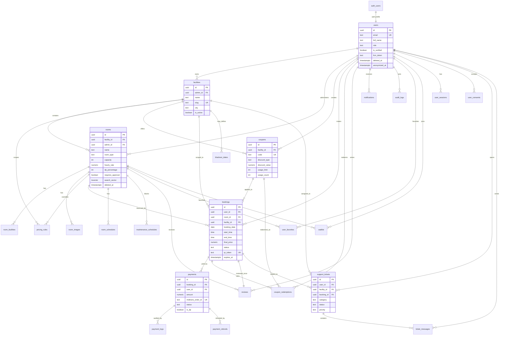

# ClassRent Complete ERD

## Notes
- `facilities` are the top-level multi-tenant boundary; admins own facilities, staff access is scoped through `staff_room_assignments`.
- `bookings` uses a PostgreSQL `EXCLUDE` constraint to prevent overlapping active bookings for the same room.
- `room_analytics` is a materialized view refreshed by cron in production.
- All app tables have RLS enabled; service-role Edge Functions perform privileged payment, QR, image, and role-management flows.
